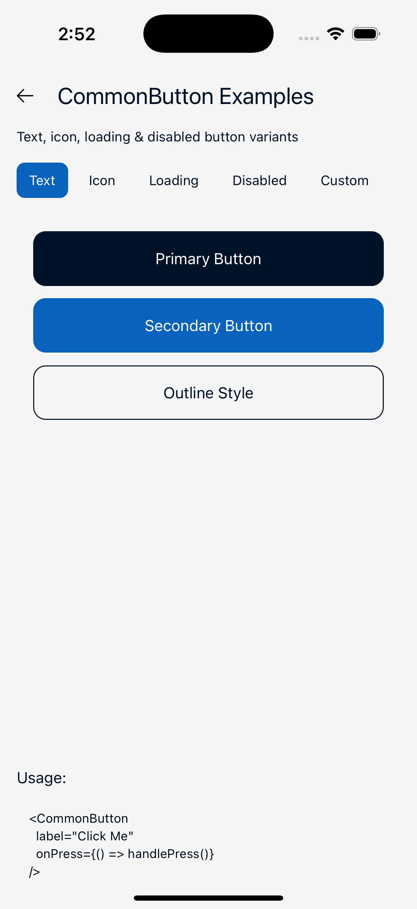
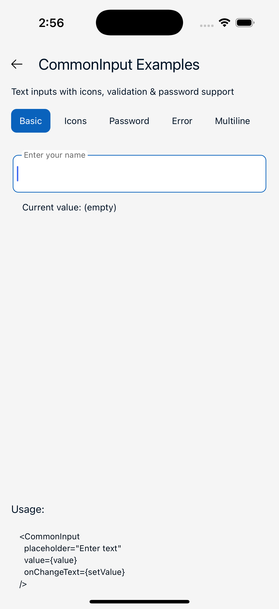
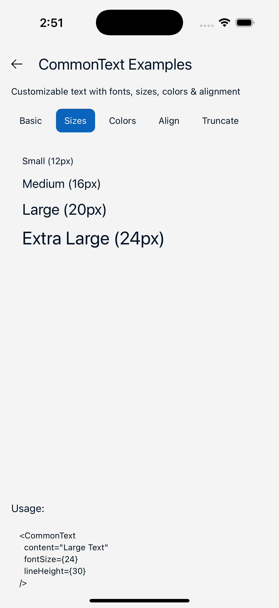
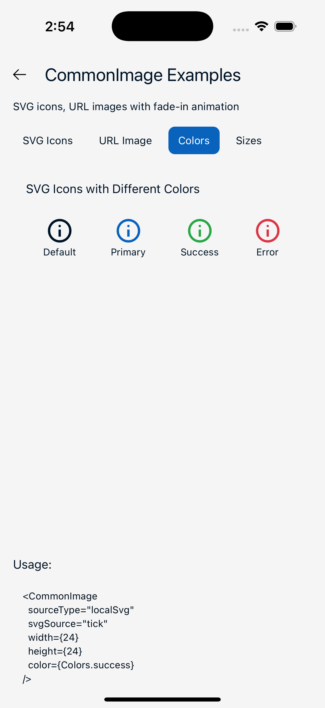
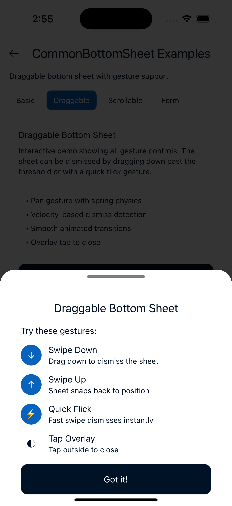
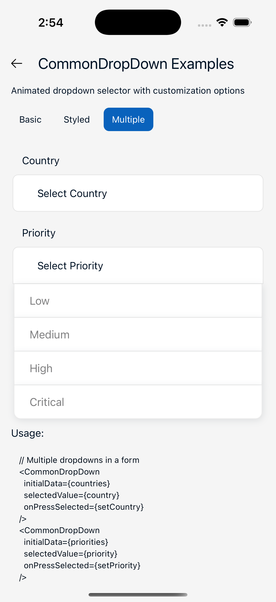
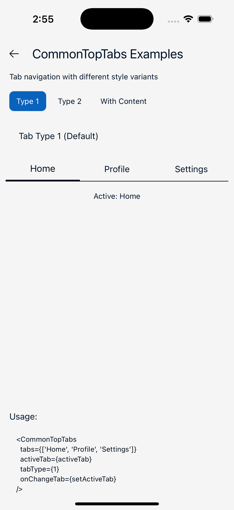

# React Native Boilerplate

A professional, feature-rich, and production-ready boilerplate for React Native applications. Built with TypeScript, this template provides a solid foundation with best practices, optimized performance, and a comprehensive set of reusable components.

[](https://reactnative.dev/)
[](https://www.typescriptlang.org/)
[](LICENSE)

---

## Examples

> Quick examples to get you started with the most commonly used components.

### CommonButton



```tsx
import { CommonButton } from '@components';

// Text button
<CommonButton
  label="Submit"
  onPress={handleSubmit}
  width="100%"
  height={48}
/>

// With loading state
<CommonButton
  label="Submit"
  loader={isLoading}
  disabled={isLoading}
  onPress={handleSubmit}
/>

// Icon button
<CommonButton
  contentType="localSvg"
  svgType="arrowleft"
  svgColor="#fff"
  imgWidth={24}
  imgHeight={24}
  onPress={handleBack}
/>
```

### CommonInput



```tsx
import { CommonInput } from '@components';

// Email input
<CommonInput
  placeholder="Enter email"
  value={email}
  onChangeText={setEmail}
  keyboardType="email-address"
  leftIcon="email"
  msgError={emailError}
/>

// Password input with toggle
<CommonInput
  placeholder="Password"
  value={password}
  onChangeText={setPassword}
  secureTextEntry={!showPassword}
  rightIcon={showPassword ? 'eye_show' : 'eye_hide'}
  onPressRightIcon={() => setShowPassword(!showPassword)}
/>
```

### CommonText



```tsx
import { CommonText } from '@components';

<CommonText
  content="Hello World"
  fontSize={16}
  fontType="InterBold"
  color="#333"
  textAlign="center"
/>
```

### CommonImage



```tsx
import { CommonImage } from '@components';

// SVG icon
<CommonImage
  sourceType="localSvg"
  svgSource="arrowleft"
  width={24}
  height={24}
  color="#000"
/>

// Remote image
<CommonImage
  sourceType="url"
  source="https://example.com/image.jpg"
  width={200}
  height={150}
  resizeMode="cover"
/>
```

### CommonBox


```tsx
import { CommonBox } from '@components';

// Basic usage
<CommonBox>
  <YourContent />
</CommonBox>

// With scroll and keyboard avoidance
<CommonBox
  useScrollView
  useKeyboardAvoidingView
  statusBarStyle="light-content"
>
  <YourFormContent />
</CommonBox>
```

### CommonBottomSheet



```tsx
import { CommonBottomSheet } from '@components';

<CommonBottomSheet
  isVisible={showSheet}
  onClose={() => setShowSheet(false)}
  isScrollable={true}
>
  {() => <YourContent />}
</CommonBottomSheet>
```

### CommonDropDown



```tsx
import { CommonDropDown } from '@components';

<CommonDropDown
  initialData={['Option 1', 'Option 2', 'Option 3']}
  selectedValue={selected}
  onPressSelected={setSelected}
  highLightSelectedValue
/>
```

### CommonTopTabs



```tsx
import { CommonTopTabs } from '@components';

<CommonTopTabs
  tabs={['Home', 'Profile', 'Settings']}
  activeTab={activeTab}
  onChangeTab={setActiveTab}
  tabType={1}
/>
```

### Toast Notifications

```tsx
import { useAppDispatch, showToast } from '@redux';

const dispatch = useAppDispatch();

// Show success toast
dispatch(showToast({
  type: 'success',
  title: 'Success!',
  message: 'Operation completed',
  duration: 3000,
}));

// Toast types: 'success' | 'error' | 'info' | 'warn'
```

### Navigation

```tsx
import { useNavs } from '@hooks';

const { navigate, goback, reset, push, replace, pop } = useNavs();

navigate('Home', { userId: 123 });
goback();
reset('Login');
```

### Form Validation

```tsx
import { useValidators } from '@hooks';

const emailResult = useValidators.email('test@example.com');
// { status: true, msg: '' } or { status: false, msg: 'Email ID is not valid' }

const passwordResult = useValidators.password('Test@123');
// Requires: min 8 chars, 1 uppercase, 1 number, 1 special char
```

### Theming

```tsx
import { useTheme } from '@themes';

const { theme, currentThemeName, setTheme } = useTheme();

<View style={{ backgroundColor: theme.colors.primary }}>
  <Text style={{ color: theme.colors.text1 }}>Themed Text</Text>
</View>
```

### API Calls with React Query

```tsx
import { useLoginMutation } from '@network';

const loginMutation = useLoginMutation({
  onSuccess: (data) => dispatch(loginReducer(data)),
  onError: (error) => console.error(error),
});

loginMutation.mutate({ email, password });
```

---

## Table of Contents

- [Examples](#examples)
- [Tech Stack](#tech-stack)
- [Features](#features)
- [Project Structure](#project-structure)
- [Getting Started](#getting-started)
- [Components](#components)
- [State Management](#state-management)
- [Networking Layer](#networking-layer)
- [Navigation](#navigation)
- [Theming](#theming)
- [Hooks](#hooks)
- [Utilities](#utilities)
- [Security](#security)
- [Scripts](#scripts)

---

## Tech Stack

| Technology | Version | Purpose |
|------------|---------|---------|
| React Native | 0.81.5 | Mobile framework |
| React | 19.1.0 | UI library |
| TypeScript | Strict mode | Type safety |
| Redux Toolkit | Latest | Global state management |
| Redux Persist | Latest | State persistence |
| TanStack Query | Latest | Server state & caching |
| React Navigation 7 | Latest | Navigation |
| Axios | Latest | HTTP client |
| React Native Reanimated | Latest | Animations |
| React Native Keychain | Latest | Secure storage |

---

## Features

### Core Features
- **TypeScript** - Full type safety with strict mode enabled
- **State Management** - Redux Toolkit with encrypted persistence
- **Server State** - TanStack Query for caching, background refetch, and synchronization
- **Secure Storage** - Hardware-backed keychain storage for sensitive data
- **End-to-End Encryption** - AES-256-CBC encryption for API communication
- **Theme Support** - Light/dark themes with system preference detection
- **Responsive Design** - Percentage and aspect-ratio based sizing utilities

### UI Components
- Pre-built, memoized, and reusable components
- Full SVG support with dynamic colors
- Keyboard-aware views and inputs
- Modal system (popups, bottom sheets, image viewer)
- Toast notifications with multiple variants
- Loading indicators (global and local)

### Developer Experience
- Path aliases for clean imports (`@components`, `@hooks`, etc.)
- ESLint and Prettier pre-configured
- Jest setup for testing
- Comprehensive TypeScript types

---

## Project Structure

```
src/
├── assets/                    # Static assets
│   ├── fonts/                 # Custom fonts (Inter family)
│   └── icons/                 # SVG icon library
│
├── common/                    # Shared code
│   ├── components/            # Reusable UI components
│   │   ├── animation-samples/ # Animation examples
│   │   ├── common-bottom-sheet/
│   │   ├── common-button/
│   │   ├── common-drop-down/
│   │   ├── common-image/
│   │   ├── common-input/
│   │   ├── common-modals/
│   │   ├── common-popup/
│   │   ├── common-text/
│   │   ├── common-toast/
│   │   ├── common-top-tabs/
│   │   ├── common-wrapper/
│   │   └── loader/
│   ├── constants/             # App constants and URLs
│   └── hooks/                 # Custom React hooks
│
├── network/                   # API layer
│   ├── apis/                  # Endpoints and services
│   │   ├── endpoints/         # API endpoint definitions
│   │   └── services/          # API service functions
│   ├── middleware/            # Network manager
│   └── networkCache/          # React Query configuration
│
├── redux/                     # State management
│   ├── encryption/            # Keychain storage adapter
│   ├── reducers/              # Redux slices
│   ├── reduxHooks/            # Typed hooks
│   └── store/                 # Store configuration
│
├── routes/                    # Navigation
│   ├── initialNavigator/      # App entry point
│   └── rootNavigator/         # Stack navigators
│
├── screens/                   # Screen components
│   ├── app/                   # Authenticated screens
│   ├── auth/                  # Authentication screens
│   └── splash/                # Splash screen
│
├── themes/                    # Theming
│   ├── globalStyles/          # Global style utilities
│   ├── list/                  # Theme definitions
│   └── themeContext/          # Theme provider
│
└── utils/                     # Utilities
    ├── pixelate/              # Screen dimension utilities
    ├── responsiveUtils/       # Responsive sizing
    └── utils-func/            # Helper functions
```

---

## Getting Started

### Prerequisites

- Node.js >= 20.x
- npm or yarn
- React Native CLI
- Xcode (for iOS)
- Android Studio (for Android)

### Installation

```bash
# Clone the repository
npx @react-native-community/cli init <YOUR-APP-NAME> --template "https://github.com/dev-neerajkumarsingh/RN_Temp_BY_NEERAJ.git"

# Navigate to your project directory
cd <project-directory>/<YOUR-APP-NAME>

# Install dependencies
npm run deep-clean
```

### Running the App

```bash
# Start Metro bundler
npm start

# Run on Android
npm run android

# Run on iOS
npm run ios
```

---

## Components

All components are optimized with `React.memo` and use `useMemo`/`useCallback` for performance.

### CommonButton

A versatile button component supporting text, SVG icons, and images.

```tsx
import { CommonButton } from '@components';

// Text button
<CommonButton
  label="Submit"
  onPress={handleSubmit}
  width="100%"
  height={48}
/>

// Icon button
<CommonButton
  contentType="localSvg"
  svgType="arrowleft"
  svgColor="#fff"
  imgWidth={24}
  imgHeight={24}
  onPress={handleBack}
/>

// Loading state
<CommonButton
  label="Submit"
  loader={isLoading}
  disabled={isLoading}
  onPress={handleSubmit}
/>
```

**Props:**
| Prop | Type | Default | Description |
|------|------|---------|-------------|
| `width` | `string \| number` | `'100%'` | Button width |
| `height` | `string \| number` | `responsiveHeight(6)` | Button height |
| `contentType` | `'text' \| 'localSvg' \| 'localNonSvg' \| 'uri'` | `'text'` | Content type |
| `label` | `string` | - | Button text |
| `textColor` | `string` | `'#fff'` | Text color |
| `fontSize` | `number` | `14` | Font size |
| `fontType` | `FontTypes` | `'Clash_MEDIUM'` | Font family |
| `svgType` | `IconTypes` | - | SVG icon name |
| `svgColor` | `string` | - | SVG color |
| `disabled` | `boolean` | `false` | Disabled state |
| `loader` | `boolean` | `false` | Show loading indicator |
| `onPress` | `() => void` | - | Press handler |
| `onLongPress` | `() => void` | - | Long press handler |

---

### CommonInput

A feature-rich text input with validation, icons, and error display.

```tsx
import { CommonInput } from '@components';

<CommonInput
  placeholder="Enter email"
  value={email}
  onChangeText={setEmail}
  keyboardType="email-address"
  leftIcon="email"
  msgError={emailError}
/>

// Password input with toggle
<CommonInput
  placeholder="Password"
  value={password}
  onChangeText={setPassword}
  secureTextEntry={!showPassword}
  rightIcon={showPassword ? 'eye_show' : 'eye_hide'}
  onPressRightIcon={() => setShowPassword(!showPassword)}
/>
```

**Props:**
| Prop | Type | Default | Description |
|------|------|---------|-------------|
| `value` | `string` | **required** | Input value |
| `onChangeText` | `(text: string) => void` | **required** | Change handler |
| `placeholder` | `string` | - | Placeholder text |
| `keyboardType` | `'default' \| 'numeric' \| 'email-address' \| 'phone-pad'` | `'default'` | Keyboard type |
| `secureTextEntry` | `boolean` | `false` | Password mode |
| `leftIcon` | `IconTypes` | - | Left icon |
| `rightIcon` | `IconTypes` | - | Right icon |
| `onPressRightIcon` | `(icon: string) => void` | - | Right icon press handler |
| `msgError` | `string` | - | Error message |
| `disableError` | `boolean` | `false` | Hide error display |
| `editable` | `boolean` | `true` | Editable state |
| `multiline` | `boolean` | `false` | Multiline mode |
| `maxLength` | `number` | - | Max character length |
| `renderLeftIcon` | `() => ReactNode` | - | Custom left icon renderer |
| `renderRightIcon` | `() => ReactNode` | - | Custom right icon renderer |

---

### CommonText

Typography component with font family and responsive sizing support.

```tsx
import { CommonText } from '@components';

<CommonText
  content="Hello World"
  fontSize={16}
  fontType="InterBold"
  color="#333"
  textAlign="center"
/>

// With number of lines
<CommonText
  content={longText}
  numberOfLines={2}
  ellipsizeMode="tail"
/>
```

**Props:**
| Prop | Type | Default | Description |
|------|------|---------|-------------|
| `content` | `string` | **required** | Text content |
| `color` | `string` | `'black'` | Text color |
| `fontSize` | `number` | `14` | Font size |
| `lineHeight` | `number` | `fontSize + 5` | Line height |
| `fontType` | `FontTypes` | `'Inter_18ptBold'` | Font family |
| `textAlign` | `'left' \| 'center' \| 'right' \| 'justify'` | `'left'` | Text alignment |
| `numberOfLines` | `number` | - | Max lines |
| `ellipsizeMode` | `'head' \| 'middle' \| 'tail' \| 'clip'` | - | Truncation mode |

---

### CommonImage

Unified image component supporting SVGs, local assets, and remote URLs with fade-in animation.

```tsx
import { CommonImage } from '@components';

// SVG icon
<CommonImage
  sourceType="localSvg"
  svgSource="arrowleft"
  width={24}
  height={24}
  color="#000"
/>

// Remote image with fade-in
<CommonImage
  sourceType="url"
  source="https://example.com/image.jpg"
  width={200}
  height={150}
  resizeMode="cover"
/>

// Local asset
<CommonImage
  sourceType="localNonSvg"
  source={require('./assets/logo.png')}
  width={100}
  height={100}
/>
```

**Props:**
| Prop | Type | Default | Description |
|------|------|---------|-------------|
| `sourceType` | `'url' \| 'localNonSvg' \| 'localSvg'` | **required** | Image source type |
| `source` | `string \| number` | - | Image source (URL or require) |
| `svgSource` | `IconTypes` | - | SVG icon name |
| `width` | `string \| number` | **required** | Image width |
| `height` | `string \| number` | **required** | Image height |
| `color` | `string` | `'#000'` | SVG color |
| `resizeMode` | `'cover' \| 'contain' \| 'stretch' \| 'center'` | `'contain'` | Resize mode |
| `duration` | `number` | `500` | Fade-in animation duration (ms) |

---

### CommonBox

Main container wrapper with StatusBar, scroll, and keyboard handling.

```tsx
import { CommonBox } from '@components';

// Basic usage
<CommonBox>
  <YourContent />
</CommonBox>

// With scroll and keyboard avoidance
<CommonBox
  useScrollView
  useKeyboardAvoidingView
  statusBarStyle="light-content"
>
  <YourFormContent />
</CommonBox>

// Modal variant
<CommonBox isModal>
  <ModalContent />
</CommonBox>
```

**Props:**
| Prop | Type | Default | Description |
|------|------|---------|-------------|
| `children` | `ReactNode` | **required** | Child components |
| `loaderStatus` | `boolean` | `false` | Show shimmer loader |
| `isModal` | `boolean` | `false` | Modal styling |
| `statusBarStyle` | `'light-content' \| 'dark-content'` | `'dark-content'` | Status bar style |
| `useKeyboardAvoidingView` | `boolean` | `false` | Keyboard avoidance |
| `useScrollView` | `boolean` | `false` | Scrollable content |
| `scrollEnabled` | `boolean` | `true` | Enable scroll |

---

### CommonBottomSheet

Gesture-enabled bottom sheet with smooth Reanimated animations.

```tsx
import { CommonBottomSheet } from '@components';

<CommonBottomSheet
  isVisible={showSheet}
  onClose={() => setShowSheet(false)}
  isScrollable={true}
>
  {() => (
    <View>
      <Text>Sheet Content</Text>
    </View>
  )}
</CommonBottomSheet>
```

**Props:**
| Prop | Type | Default | Description |
|------|------|---------|-------------|
| `isVisible` | `boolean` | **required** | Visibility state |
| `onClose` | `() => void` | **required** | Close handler |
| `children` | `() => ReactNode` | - | Content render function |
| `isScrollable` | `boolean` | `false` | Enable scroll |
| `containerStyle` | `StyleProp<ViewStyle>` | - | Custom container style |

---

### CommonDropDown

Animated dropdown selector with configurable styling.

```tsx
import { CommonDropDown } from '@components';

<CommonDropDown
  initialData={['Option 1', 'Option 2', 'Option 3']}
  selectedValue={selected}
  onPressSelected={setSelected}
  highLightSelectedValue
/>
```

---

### CommonTopTabs

Tab navigation component with customizable styling.

```tsx
import { CommonTopTabs } from '@components';

<CommonTopTabs
  tabs={['Tab 1', 'Tab 2', 'Tab 3']}
  activeTab={activeTab}
  onChangeTab={setActiveTab}
  tabType={1}
/>
```

---

### CommonToaster

Redux-connected toast notification system with type-based styling.

```tsx
import { useDispatch } from 'react-redux';
import { showToast } from '@redux';

const dispatch = useDispatch();

// Show success toast
dispatch(showToast({
  type: 'success',
  title: 'Success!',
  message: 'Operation completed successfully',
  duration: 3000,
}));

// Show error toast
dispatch(showToast({
  type: 'error',
  title: 'Error',
  message: 'Something went wrong',
  duration: 5000,
}));

// Toast types: 'success' | 'error' | 'info' | 'warn'
```

---

### Loader & Shimmer

Loading indicators for global and local use. Refactored to share a common `BaseLoader` component for reusability.

```tsx
import { Loader, Shimmer, BaseLoader } from '@components';
import { showLoader, hideLoader } from '@redux';

// Global loader (Redux-connected)
// Controlled via Redux actions
dispatch(showLoader());
dispatch(hideLoader());

// The Loader component is automatically rendered in the app

// Local shimmer
<Shimmer loaderStatus={isLoading} />

// Custom loader with BaseLoader
<BaseLoader
  visible={isLoading}
  variant="secondary"  // 'primary' | 'secondary'
  size="small"         // 'small' | 'large'
  color="#custom"      // Optional custom color
/>
```

---

### CommonOtpInput

OTP input with auto-advance, paste support, and validation.

```tsx
import { CommonOtpInput } from '@components';

const [otp, setOtp] = useState(['', '', '', '', '', '']);
const [isValid, setIsValid] = useState(false);

<CommonOtpInput
  otp={otp}
  setOtp={setOtp}
  otpLength={6}
  onValidationChange={setIsValid}
/>
```

---

### CommonImagePickerModal

Image picker with camera and gallery support, permissions handling, and cropping.

```tsx
import { CommonImagePickerModal } from '@components';

<CommonImagePickerModal
  isVisible={showPicker}
  onPressClose={() => setShowPicker(false)}
  onSelectImage={(image) => {
    console.log(image.path, image.mime, image.size);
  }}
  onError={(error) => console.error(error)}
  enableCropping
  cropperCircleOverlay
  compressQuality={0.8}
/>
```

**Props:**
| Prop | Type | Default | Description |
|------|------|---------|-------------|
| `isVisible` | `boolean` | **required** | Visibility state |
| `onPressClose` | `() => void` | **required** | Close handler |
| `onSelectImage` | `(image) => void` | **required** | Image selection handler |
| `onError` | `(error) => void` | - | Error handler |
| `enableCropping` | `boolean` | `false` | Enable image cropping |
| `cropperCircleOverlay` | `boolean` | `false` | Circular crop overlay |
| `compressQuality` | `number` | `0.8` | Image compression (0-1) |
| `multiple` | `boolean` | `false` | Allow multiple selection |

---

## State Management

### Redux Store Structure

```typescript
{
  auth: {
    isAuthenticated: boolean;
    userData: object | null;
    accessToken: string | null;
    refreshToken: string | null;
  },
  loader: {
    status: boolean;
  },
  toast: {
    status: boolean;
    type: 'success' | 'error' | 'info' | 'warn';
    title: string;
    message: string;
    duration: number;
  },
  errorScreen: {
    status: boolean;
    title: string;
    message: string;
    buttonLabel: string;
    networkConfig: object | null;
  },
  popup: {
    status: boolean;
    title: string;
    buttonLabel: string;
    onPressType: string;
  },
  lang: {
    selectedLang: string;
  },
  theme: {
    theme: object;
  }
}
```

### Using Redux

```tsx
import { useAppDispatch, useAppSelector } from '@redux';
import { loginReducer, logoutReducer } from '@redux';

// Read state
const { isAuthenticated, userData } = useAppSelector(state => state.auth);

// Dispatch actions
const dispatch = useAppDispatch();

dispatch(loginReducer({
  isAuthenticated: true,
  userData: user,
  accessToken: token,
  refreshToken: refresh,
}));

dispatch(logoutReducer());
```

### Available Actions

| Slice | Actions |
|-------|---------|
| `auth` | `loginReducer`, `logoutReducer`, `refreshTokenReducer` |
| `loader` | `showLoader`, `hideLoader` |
| `toast` | `showToast`, `hideToast` |
| `errorScreen` | `showErrorScreen`, `hideErrorScreen` |
| `popup` | `showPopup`, `hidePopup` |
| `lang` | `selectLang`, `defaultLang` |
| `theme` | `selectTheme`, `defaultTheme` |

### Secure Persistence

Redux state is automatically persisted using a custom Keychain storage adapter that encrypts data before storing.

---

## Networking Layer

### NetworkManager

Central middleware for all API calls with automatic encryption, token injection, and error handling.

```tsx
import { NetworkManager } from '@network';
import { API } from '@network';

// Basic API call
const response = await NetworkManager({
  api: API.Authenticated.FETCH_PROFILE,
  apiParams: { userId: 123 },
  apiBody: {},
});

if (response.success) {
  console.log(response.data);
} else {
  console.error(response.error);
}

// With React Query integration (skip default toast/error handling)
const response = await NetworkManager({
  api: API.NonAuthenticated.LOGIN,
  apiBody: { email, password },
  skipToast: true,
  skipErrorScreen: true,
});
```

### NetworkResponse Type

```typescript
interface NetworkResponse<T = any> {
  success: boolean;
  data: T | null;
  error: string;
  code: number;
  message: string;
}
```

### React Query Hooks

Pre-built mutation hooks for common operations:

```tsx
import { useLoginMutation, useLogoutMutation } from '@network';

// Login mutation
const loginMutation = useLoginMutation({
  onSuccess: (data) => {
    dispatch(loginReducer(data));
  },
  onError: (error) => {
    console.error(error);
  },
});

loginMutation.mutate({ email, password });

// Check loading state
if (loginMutation.isPending) {
  // Show loading
}
```

### Defining API Endpoints

Add endpoints in `src/network/apis/endpoints/Endpoints.ts`:

```typescript
export const API = {
  NonAuthenticated: {
    LOGIN: { endpoint: 'api/user/v1/auth/login', method: HTTP_METHODS.POST },
    SIGNUP: { endpoint: 'api/user/v1/auth/register', method: HTTP_METHODS.POST },
    FORGOT_PASSWORD: { endpoint: 'api/user/v1/auth/forgot', method: HTTP_METHODS.POST },
  },
  Authenticated: {
    FETCH_PROFILE: { endpoint: 'api/user/v1/account/profile', method: HTTP_METHODS.GET },
    LOGOUT: { endpoint: 'api/user/v1/auth/logout', method: HTTP_METHODS.POST },
    REFRESH_TOKEN: { endpoint: 'api/user/v1/auth/refresh', method: HTTP_METHODS.POST },
  },
};
```

---

## Navigation

### Navigation Structure

```
InitialNavigator
└── RootNavigator
    ├── SplashStack
    │   └── Splash (auth check)
    ├── AuthStack (non-authenticated)
    │   ├── Onboard
    │   ├── Login
    │   ├── Signup
    │   ├── ForgotPassword
    │   └── OTP
    └── AppStack (authenticated)
        ├── Home
        └── Profile
```

### Using Navigation

```tsx
import { useNavs } from '@hooks';

// Navigate to screen
useNavs.navigate('Home', { userId: 123 });

// Go back
useNavs.goback();

// Reset navigation stack
useNavs.reset({
  index: 0,
  routes: [{ name: 'AppStack' }],
});

// Push to stack
useNavs.push('Profile', { userId: 123 });

// Replace current screen
useNavs.replace('Login');

// Pop screens
useNavs.pop(2); // Go back 2 screens
```

---

## Theming

### Using Themes

```tsx
import { useTheme } from '@themes';

const MyComponent = () => {
  const { theme, currentThemeName, setTheme } = useTheme();

  return (
    <View style={{ backgroundColor: theme.colors.primary }}>
      <Text style={{ color: theme.colors.text1 }}>
        Current theme: {currentThemeName}
      </Text>
      <Button onPress={() => setTheme('dark')} title="Dark Mode" />
    </View>
  );
};
```

### Theme Structure

```typescript
{
  name: 'light' | 'dark',
  colors: {
    // Primary colors
    primary: string,
    secondary: string,
    tertiary: string,
    quaternary: string,
    quinary: string,
    senary: string,

    // Status colors
    error: string,
    success: string,
    warning: string,
    info: string,

    // Light status colors (for backgrounds)
    lightError: string,
    lightSuccess: string,
    lightWarning: string,
    lightInfo: string,

    // Text colors
    text1: string,
    text2: string,
    lightText: string,

    // Other
    borderColor1: string,
    grey1: string,
    grey2: string,
    white: string,
    black: string,
    transparent0: string,
    // ... and more
  }
}
```

### Global Styles

```tsx
import { GlobalStyles } from '@themes';

const { theme } = useTheme();
const globalStyles = GlobalStyles(theme);

<View style={globalStyles.centerContent}>
  <View style={globalStyles.commonShadow}>
    {/* Content */}
  </View>
</View>

// Available global styles:
// - centerContent: Center align content
// - commonBox: Full screen container
// - commonModalBox: Modal container
// - commonShadow: Shadow styling
```

---

## Hooks

### useValidators

Form validation utilities with comprehensive rules.

```tsx
import { useValidators } from '@hooks';

// Email validation
const emailResult = useValidators.email('test@example.com');
// { status: true, msg: '' }
// { status: false, msg: 'Email ID is not valid' }

// Phone validation (Indian format)
const phoneResult = useValidators.phoneNumber('9876543210');
// { status: true, msg: '' }
// { status: false, msg: 'Mobile No. should start with digits 6, 7, 8, or 9.' }

// Password validation
// Requirements: min 8 chars, 1 uppercase, 1 number, 1 special character
const passwordResult = useValidators.password('Test@123');
// { status: true, msg: '' }
// { status: false, msg: 'Password should have 1 uppercase letter.' }

// OTP validation
const otpResult = useValidators.otp(['1', '2', '3', '4', '5', '6']);
// { status: true, msg: '' }
```

### useTryCatch

Promise error handling utility with discriminated union return type.

```tsx
import { useTryCatch } from '@hooks';

const { data, error } = await useTryCatch(someAsyncFunction());

if (error) {
  console.error('Error:', error);
} else {
  console.log('Success:', data);
}
```

### useNavs

Navigation utility hook (see Navigation section).

### useAppDispatch & useAppSelector

Typed Redux hooks (see State Management section).

---

## Utilities

### Responsive Sizing

```tsx
import {
  responsiveHeight,
  responsiveWidth,
  responsiveFontSize,
  SCREEN_WIDTH,
  SCREEN_HEIGHT,
} from '@utils';

// Static utilities
const height = responsiveHeight(10);  // 10% of screen height
const width = responsiveWidth(50);    // 50% of screen width
const fontSize = responsiveFontSize(2);

// Screen dimensions
console.log(SCREEN_WIDTH, SCREEN_HEIGHT);

// Hook versions (re-calculate on dimension changes)
import { useResponsiveHeight, useResponsiveWidth } from '@utils';

const height = useResponsiveHeight(10);
const width = useResponsiveWidth(50);
```

### Pixelate Utilities

```tsx
import { Pixelate } from '@utils';

Pixelate.widthNormalizer(100);   // Normalize width based on design
Pixelate.heightNormalizer(100);  // Normalize height based on design
Pixelate.fontPixel(16);          // Normalize font size
Pixelate.screenWidth;            // Current screen width
Pixelate.screenHeight;           // Current screen height
```

### Encryption Utilities

```tsx
import { UtilsFunc } from '@utils';

// Encrypt data (AES-256-CBC)
const encrypted = UtilsFunc.encryptData(JSON.stringify(data));

// Decrypt data
const decrypted = JSON.parse(UtilsFunc.decryptData(encrypted));
```

---

## Security

### API Encryption

- **Algorithm**: AES-256-CBC
- **Request Encryption**: All API request bodies are encrypted before sending
- **Response Decryption**: All API responses are decrypted automatically
- **URL Parameters**: Query parameters are also encrypted

### Secure Storage

- Redux state is persisted using React Native Keychain
- Hardware-backed encryption on supported devices
- Automatic encryption/decryption of persisted state

### Token Management

- Access tokens stored securely in Keychain
- Automatic token injection in API request headers
- 401 response handling with automatic logout
- Refresh token support for session renewal

---

## Scripts

| Script | Description |
|--------|-------------|
| `npm start` | Start Metro bundler |
| `npm run android` | Run on Android |
| `npm run ios` | Run on iOS |
| `npm run lint` | Run ESLint |
| `npm run test` | Run Jest tests |
| `npm run android-clean` | Clean and run Android |
| `npm run ios-clean` | Clean pods and run iOS |
| `npm run android-release` | Build Android release |
| `npm run deep-clean` | Full clean and reinstall |

---

## Path Aliases

Clean imports using TypeScript path aliases:

```typescript
@icons      → ./src/assets/icons/index.ts
@fonts      → ./src/assets/fonts/index.ts
@components → ./src/common/components/index.ts
@constants  → ./src/common/constants/index.ts
@hooks      → ./src/common/hooks/index.ts
@routes     → ./src/routes/index.ts
@screens    → ./src/screens/index.ts
@network    → ./src/network/index.ts
@redux      → ./src/redux/index.ts
@themes     → ./src/themes/index.ts
@utils      → ./src/utils/index.ts
```

---

## Adding New Icons

1. Add your SVG file to `src/assets/icons/list/`
2. Import it in `src/assets/icons/index.ts`
3. Add the icon name to `IconTypes` type
4. Register it in the `SVG_COMPONENTS` map in `CommonImage.tsx`

```tsx
// In CommonImage.tsx, add to SVG_COMPONENTS:
const SVG_COMPONENTS: Record<IconTypes, React.FC<any>> = {
  // ... existing icons
  your_icon: YourIconSvg,
};
```

---

## Contributing

Contributions are welcome! Please feel free to open an issue or submit a pull request.

---

## License

MIT License
